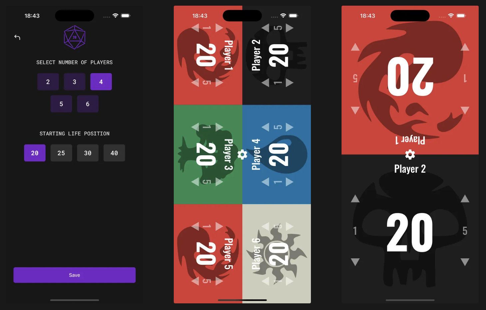
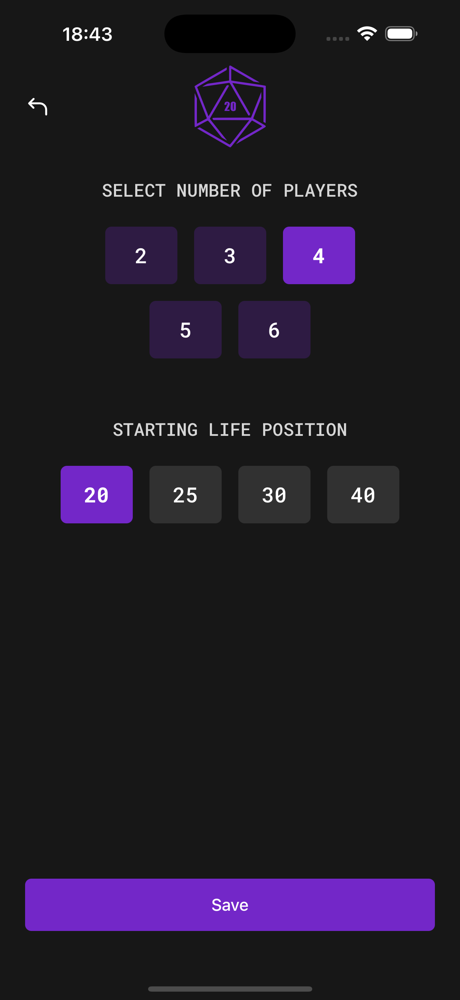
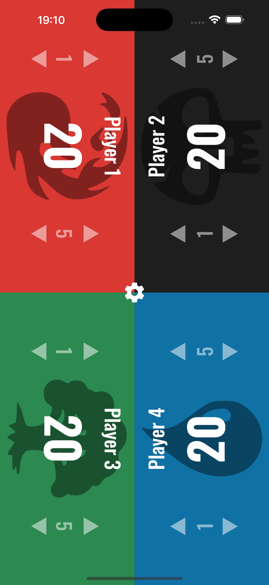
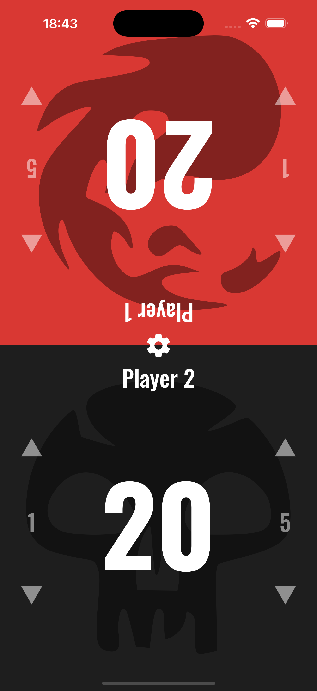

# MTG Life Counter



Um aplicativo desenvolvido em **React Native (Expo + Bare Workflow)** para auxiliar jogadores de _Magic: The Gathering_ a controlarem os pontos de vida durante suas partidas.

## 🚀 Funcionalidades

-   Suporte para **2 a 6 jogadores**.
-   Alteração da **vida inicial dos jogadores** na tela de configurações (20, 25, 30 ou 40 pontos).
-   Interface colorida e intuitiva, com um contador individual para cada jogador.
-   Botões para adicionar ou remover pontos de vida rapidamente (-5, -1, +1, +5).
-   Layout responsivo que se adapta automaticamente ao número de jogadores.

## 📱 Screenshots

| Tela de Configurações                              | Tela de Jogo (4 jogadores)                     | Tela de Jogo (2 jogadores)                      |
| -------------------------------------------------- | ---------------------------------------------- | ----------------------------------------------- |
|  |  |  |

## 🛠️ Tecnologias Utilizadas

-   [React Native](https://reactnative.dev/)
-   [Expo](https://expo.dev/) (Bare Workflow)
-   [TypeScript]
-   [Expo router]

## ⚙️ Instalação e Uso

Clone este repositório:

```bash
git clone https://github.com/santyasm/mtg-life-counter.git
cd mtg-life-counter
```

Instale as dependências:

```bash
npm install
# ou
yarn install
```

Execute o app em ambiente de desenvolvimento:

```bash
npx expo start
```

Rodar no iOS ou Android:

```bash
npx expo run:ios
npx expo run:android
```

## 📂 Estrutura do Projeto

```bash
mtg-life-counter/
├── android/                # Arquivos nativos Android
├── ios/                    # Arquivos nativos iOS
├── assets/                 # Ícones, imagens e fontes globais
├── scripts/                # Scripts auxiliares
├── src/                    # Código-fonte principal
│   ├── @types/             # Definições de tipos TypeScript
│   ├── app/                # Configuração e entrypoint das telas
│   ├── assets/             # Recursos usados internamente (imagens, ícones, etc.)
│   ├── components/         # Componentes reutilizáveis
│   ├── constants/          # Constantes do app
│   ├── contexts/           # Context API (estado global)
│   ├── hooks/              # Hooks customizados
│   ├── reducers/           # Reducers para gerenciamento de estado
│   └── styles/             # Estilos globais
├── .expo/                  # Configurações do Expo
├── .vscode/                # Configurações do VSCode
├── .gitignore
├── .prettierrc             # Configuração do Prettier
├── app.json                # Configurações do Expo
├── eslint.config.js        # Configuração do ESLint
├── expo-env.d.ts           # Definições do Expo
├── index.js                # Arquivo inicial do React Native
├── metro.config.js         # Configuração do Metro bundler
├── package.json
└── README.md
```

🔮 Próximos Passos (To-do)

-   Implementar suporte a contadores de veneno e energia;
-   Customização de nomes e cores por jogador;
-   Salvar configurações entre partidas.
